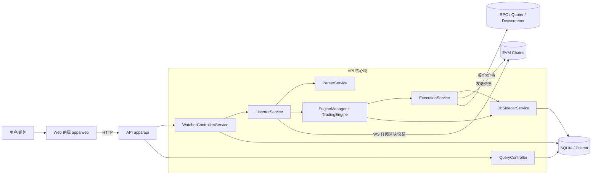

# ChainQuant

面向 Web3 量化与跟单场景的 **pnpm monorepo**：后端提供链上监听、交易执行与业务 API；前端提供钱包连接、Watcher 管理与跟单视图。默认开发环境使用 **SQLite** 持久化，生产部署可按需替换为其他数据库（需同步调整 Prisma）。

---

## 仓库结构

| 路径 | 说明 |
|------|------|
| `apps/api` | NestJS 服务（HTTP API、链上 Listener、执行层、Watcher 等） |
| `apps/web` | Next.js 15（App Router）前端 |
| `packages/db` | Prisma Schema、迁移与 `@chainquant/db` 数据访问层 |

根目录脚本通过 `pnpm -r` 并行/递归编排各子包。

### 目录树（核心文件）

```text
chainquant/
├─ apps/
│  ├─ api/
│  │  ├─ src/
│  │  │  ├─ listener/        # 链上监听与交易解析（区块扫描、V3/V4 解析）
│  │  │  ├─ execution/       # 实盘执行（含 pending 超时加价重发）
│  │  │  ├─ watcher/         # Watcher 管理与配置更新
│  │  │  ├─ engine/          # 状态机引擎（信号→入场→持仓→平仓）
│  │  │  ├─ query/           # Dashboard / Trades / Events 查询接口
│  │  │  ├─ persistence/     # DB sidecar（非阻塞落库）
│  │  │  └─ ...
│  │  ├─ .env.example
│  │  └─ package.json
│  └─ web/
│     ├─ src/
│     │  ├─ app/             # Next App Router 页面入口
│     │  ├─ pages/           # 业务页面（Watcher、Stats、Copier 详情）
│     │  ├─ components/
│     │  ├─ hooks/
│     │  └─ ...
│     └─ package.json
├─ packages/
│  └─ db/
│     ├─ prisma/
│     │  ├─ schema.prisma
│     │  └─ migrations/
│     ├─ src/
│     │  ├─ repos/
│     │  └─ queries/
│     └─ package.json
├─ pnpm-workspace.yaml
├─ package.json
└─ README.md
```

---

## 技术栈

- **运行时**：Node.js（建议 LTS）
- **包管理**：pnpm 8.x（见根目录 `packageManager` 字段）
- **后端**：NestJS 11、ethers v6、Prisma 6、SIWE
- **前端**：Next.js 15、React 19、wagmi / viem、Tailwind CSS 4
- **数据库**：开发默认 SQLite（`packages/db/prisma/dev.db`）

---

## 环境要求

- [Node.js](https://nodejs.org/)（LTS）
- [pnpm](https://pnpm.io/) 8（与根 `package.json` 中 `packageManager` 一致）

```bash
corepack enable
corepack prepare pnpm@8.15.9 --activate
```

---

## 快速开始

### 1. 安装依赖

```bash
pnpm install
```

### 2. 数据库（Prisma）

在 `packages/db` 下生成 Client 并应用 schema（开发可用 `db:push`，有迁移历史时可用 `db:migrate`）：

```bash
cd packages/db
pnpm run db:generate
pnpm run db:push
# 或：pnpm run db:migrate
cd ../..
```

本地 SQLite 文件路径见 `packages/db/prisma/schema.prisma` 中 `datasource db`。`dev.db` 已在 `packages/db/.gitignore` 中忽略，勿提交。

### 3. 配置 API 环境变量

```bash
cp apps/api/.env.example apps/api/.env
```

按需填写（说明见 `apps/api/.env.example` 内注释），常见项包括：

- **链监听**：各链 WebSocket 地址（如 `ARB_WS_URL`），未配置则对应链 Listener 不启动。
- **CORS**：`CORS_ORIGINS`（逗号分隔）。
- **实盘换币（Arbitrum，当前实现范围）**：`RPC_URL`、`PRIVATE_KEY`。
- **交易 pending 与 gas 替换（可选）**：
  - `EXEC_TX_PENDING_TIMEOUT_MS`（默认 `45000`）
  - `EXEC_TX_MAX_GAS_BUMPS`（默认 `4`）
  - `EXEC_TX_GAS_BUMP_NUM`（默认 `115`，即约 1.15 倍）

### 4. 前端 API 基址（可选）

若 API 非本机默认端口，在 `apps/web` 侧通过环境变量指定（例如 `.env.local`）：

```bash
NEXT_PUBLIC_API_BASE_URL=http://localhost:3001
```

### 5. 开发模式

在**仓库根目录**并行启动各包 `dev`：

```bash
pnpm dev
```

默认习惯：

- 前端：<http://localhost:3000>
- API：<http://localhost:3001>（以 `main.ts` 中 `listen` 为准）

### 6. 生产构建

```bash
pnpm build
```

各子包产物路径遵循各自配置（如 `apps/api/dist`、`apps/web/.next`）。

---

## 常用命令

| 命令 | 说明 |
|------|------|
| `pnpm dev` | 根目录并行执行各 workspace 的 `dev` |
| `pnpm build` | 全仓库 `build` |
| `pnpm --filter @chainquant/db run db:generate` | 仅生成 Prisma Client |
| `pnpm --filter @chainquant/api run build` | 仅构建 API |

---

## 架构要点（只读说明）

- **Watcher**：地址与运行时配置存于数据库 JSON；启动后由 Listener 按链订阅新区块并解析目标 Router 上的 swap。
- **解析**：Uniswap V3 `exactInputSingle` 以 calldata 解码为主；V4 Universal Router 结合 receipt 日志。
- **执行**：`paper` 模式不发链；`live` 模式使用配置私钥在 Arbitrum 上执行受控 swap，并通过进程内串行与可选的 **pending 超时 + 同 nonce 加价重发** 降低拥堵下的卡单风险。

更细的接口与领域模型以源码与 OpenAPI（若有）为准。

### 架构图（运行时数据流）



---

## 许可与贡献

若需对外开源，请在根目录补充 `LICENSE` 并在此节指向该文件；贡献流程（Issue / PR、代码风格）可由团队另行约定。

---

## 相关路径

- API 环境变量示例：`apps/api/.env.example`
- Prisma Schema：`packages/db/prisma/schema.prisma`
